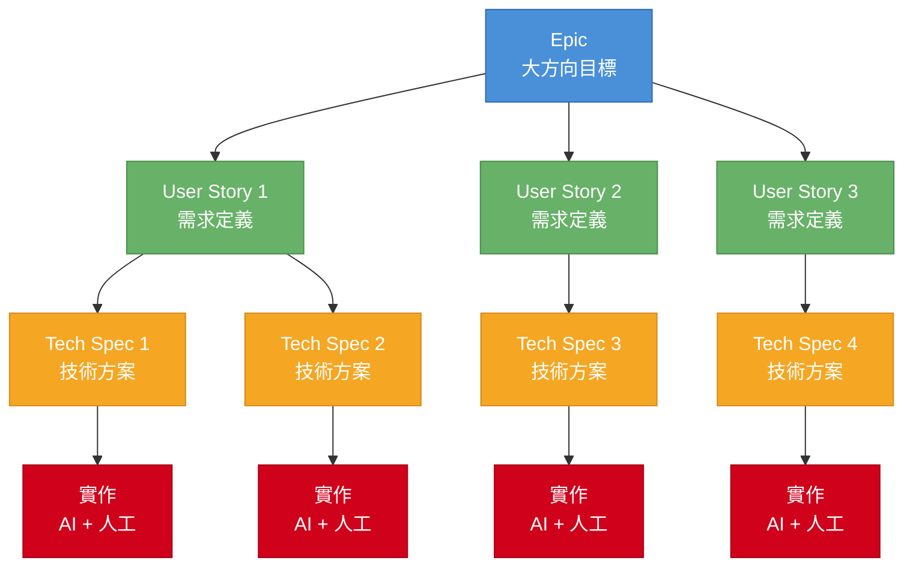

# Skills / Rules / Agents 概念整理

當我們有需求的時候，要怎麼決定用哪一個工具來定義工作方式？

## Skill — 可重用的操作函式

Skill 是 Claude 可以主動呼叫的「工具」，每個 skill 封裝一個具體動作（例如讀取檔案、呼叫 API、執行 shell 指令）。它無狀態、可組合，Claude 會在推理過程中自行判斷何時呼叫哪個 skill。
> 可以被組合被重複利用這點我覺得很重要


**實用場景：**
- 有一個讀取資料庫的動作被許多任務共用 → 寫成 skill 複用
- 抓取網頁內容、格式轉換、發送通知等原子操作

## Rule — 永遠遵守的限制或風格

Rule 是全局行為約束，跟任務無關，只要 Claude 在運作就會套用。它不會被 Claude「決定要不要用」，而是直接塑造 Claude 的行為邊界。

**實用場景：**
- 「回覆永遠用繁體中文」
- 「不允許刪除 production 資料庫的記錄」
- 「每次修改程式碼前必須先寫測試」
- 「輸出程式碼時一律用特定的 code style」

## Agent — 可自主執行的子任務單元

Agent 是一個有推理能力的執行單元，可以接受目標、自行規劃步驟、呼叫 skills、做決策，直到完成子任務。與 skill 的差別：skill 只做「一件事」；agent 會做「一連串事情」並自行判斷下一步。

**實用場景：**
- 「分析這個 PR，找出潛在 bug，並提出修改建議」→ agent 自行決定要讀哪些檔案、跑哪些測試、最後回報結果
- 多個 agent 協作：orchestrator agent 拆解任務，再派給多個 subagent 各自執行

## 三者的關係

```
Rule（一直在）
  └─ 約束所有行為

Claude/Agent（主控）
  └─ 呼叫 Skill（做原子動作）
  └─ 派出 subagent（做複雜子任務）
```

**總結：Rule 行為原則、Skill 工具、Agent 決策者。**
Rule 決定邊界，決定行為的最高原則，大多是線性的
Skill 工具，工具的定義需要可以被重複使用，這點我認為是很重要
agent 帶著 Skill 在 Rule 的框架內完成目標，目標不是線性但有一定的範圍內做模糊的決策


# 如何與 AI 協作與分工

目前我們已有多種強大的 AI 工具，但關鍵問題是：**怎麼與它有效協作？**

## 兩種極端與問題

### 極端一：全部丟給 AI（過度放手）
- 把需求全塞進 prompt，一次叫 AI 完成所有事
- 短期可拿到「堪用」的程式碼
- **問題：**
  - 隨時間推移，AI 愈來愈難聚焦在當前任務
  - 消耗大量 token
  - 難以 fallback、難以 review，整個流程變成黑箱

### 極端二：每次只叫 AI 做一件小事（過度介入）
- 人盯在電腦前，逐步微管理每個步驟
- **問題：**
  - 生產力提升幅度遠低於預期
  - 人的精力消耗在瑣事上，失去 AI 帶來的槓桿效益

## 找到平衡點

> **人類介入的時間點，就是關鍵。**

- 需要找到自己的節奏與習慣
- 思考如何做好**功能拆分**
- 明確定義哪些時間點**必須**由人類介入
- 這些介入點通常就是**需求確認的 checkpoint**，確保方向正確再繼續

# 現實的開發案例：INote 專案

> 目前我還在摸索，這些未必是正確的，但可以對沒有方向的人作為參考。

INote 是一個 Next.js 靜態筆記知識庫，從 Hugo 遷移而來。整個專案從初始化到現在所有功能，幾乎都是與 AI 協作完成的。

## 專案背景

原本用 Hugo 架筆記站，但發現一個核心痛點：Hugo 是純靜態網站產生器，難以擴充客製功能。想在筆記站裡加入編輯器、圖片上傳、搜尋、終端機整合等功能，Hugo 的架構根本無法支撐。改用 Next.js 之後，可以自由加 API Route、client component、WebSocket，擴充空間大得多。

這種「問題清楚、方向明確」的任務，很適合直接交給 AI 執行，人只需要在最後驗收結果。

## 實際開發流程

我在這個專案建立了一套標準流程，用來控制 AI 的工作邊界：

```
/new-feature  →  撰寫 user-story（草稿）
     ↓
人工審核：確認需求方向正確  ← 第一個 checkpoint
     ↓
status: approved
     ↓
/tech-spec  →  AI 產出技術方案
     ↓
人工審核：確認方案可行、無遺漏  ← 第二個 checkpoint
     ↓
AI 實作
     ↓
/commit
```

**兩個 checkpoint 是關鍵。** 不是每一行程式碼都需要人盯，但需求定義和技術方案這兩關，人必須親自過。

## 具體案例：圖片貼上自動上傳

這個功能是某天在編輯筆記時，想截圖直接貼進編輯器，發現沒有這個功能才提出的。

**我的輸入（user-story 核心）：**
- 在編輯模式的 textarea 貼上圖片
- 自動上傳到 `public/images/`


**AI 幫我想到但我沒提的（tech-spec 補充）：**
- 檔名衝突問題 → 用 `Date.now() + 隨機碼` 解決
- 檔案類型與大小限制（10MB、PNG/JPEG/WebP/GIF）

這就是 AI 協作的價值之一：**它會幫你補上你沒想到的 edge case**，我會跟 AI 釐清他所有的疑慮，才會進入開發。

## 哪些地方我還是得親自來

- **需求的制定**：/new-feature 什麼要做、什麼不做
- **技術方案**：你可以在 /tech-spec 階段跟 AI 討論
- **跨功能的影響評估**：某個改動會不會 break 其他地方，我有請 AI 寫出會異動的範圍，哪些檔案 
- **程式碼 review**: 這個就要看個人，尤其核心功能一定要親自看過
- **驗收**：最終確認功能符合預期才算完成
- **Git Commit**: 提交 /commit

## 背後支撐這套流程的 Rules 與 Skills

這套流程能運作，是因為我在專案裡事先定義好了 rules 和 skills，讓 AI 知道邊界在哪、每個步驟怎麼執行。

### Rules（行為約束）

| Rule | 作用 |
|------|------|
| **Feature Doc 規範** | 開始新功能前，AI 必須提示先執行 `/new-feature`；`user-story` 處於 `draft` 時只討論需求，不進技術設計；未經確認不得擅自將 status 改為 `approved` |

這個 rule 的核心是**強制人類在關鍵節點介入**，確保 AI 不會跳過 user-story 直接開工，也不會自己批准自己的方案。

### Skills（可重用工具）

| Skill | 觸發方式 | 做什麼 |
|-------|----------|--------|
| **new-feature** | `/new-feature` | 建立功能資料夾與 `user-story.md` 草稿，逐步引導填寫背景、使用者故事、驗收條件 |
| **tech-spec** | `/tech-spec` | 確認 user-story 已 approved 後，建立 `tech-spec.md`，填寫技術方案、影響範圍、API 變更、Edge Cases |
| **commit** | `/commit` | 執行 `git status` + `git diff`，自動分析變更類型、擬定 commit message，列出納入檔案後請使用者確認再提交 |
| **doc-summary** | `/doc-summary` | 讀取 doc/ 下的功能文件，摘要近期改動並更新 CLAUDE.md，保留最近 10 個 doc，其餘刪除 |

## 小結

這套流程讓我在開發 INote 的過程中，把大部分「執行」交給 AI，人的精力集中在「方向確認」和「驗收」。不是所有功能都完美，但整體節奏是順的——不會卡在不知道 AI 在做什麼，你可以決定每一次的 feature 大小，也不會因為一次給太多而失控

## 心得

AI 可以透過讀大量文件來理解整個架構，但前提是文件本身要夠集中、夠清晰。

目前多數團隊的文件資源散落各處（ClickUp、Notion、口頭溝通），跨專案協作時尤為明顯。以「改登入系統」為例，需要 PM、前後端共同參與，但相關文件分散且難以閱讀，協作成本很高。

一個有效的思考方式是：**先問人能不能在不打電話、不開會的情況下順利交付任務**。如果人可以，AI 大多也有機會做到；如果連人都搞不清楚，AI 更無從下手。

因此，改善**資料的控制權**與**文件修改交付的流程**，是提升 AI 協作效能的根本。

AI 閱讀文件的方式通常是整份讀取。雖然現在 AI 的 context window 已經很大，但文件越大，AI 越容易「失焦」——注意力分散、token 消耗多、執行速度也變慢。

其實很多時候，AI 只需要看到 `ls -l` 的輸出，就能判斷要去找哪些檔案，不需要把全部內容都塞進來。這也是我在這個專案裡把新功能開發文件**以時間序列方式管理**的原因：每次只給 AI 最近、最相關的那幾份文件，不讓它淹沒在歷史資訊裡。這樣做的副作用也很好——人類可以做小範圍的審查，也方便事後溯源。

## 文件管理架構
其實就是照著組織的需求以及原本的流程去走



每一層都有明確的 checkpoint：

- **Epic → User Story**：拆解大目標為可交付的獨立需求
- **User Story → Tech Spec**：需求 `approved` 後才進入技術設計
- **Tech Spec → 實作**：技術方案確認後才開始寫程式碼

這樣的層級管理確保每個功能都有跡可循，也讓 AI 在任何一層都能快速取得所需的上下文，不需要讀完整個專案歷史。
